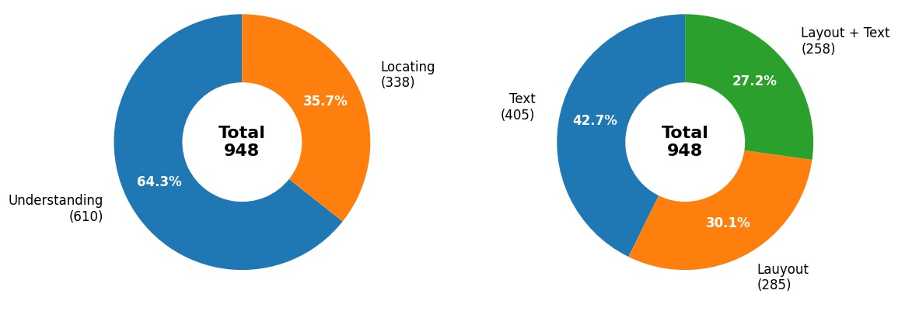
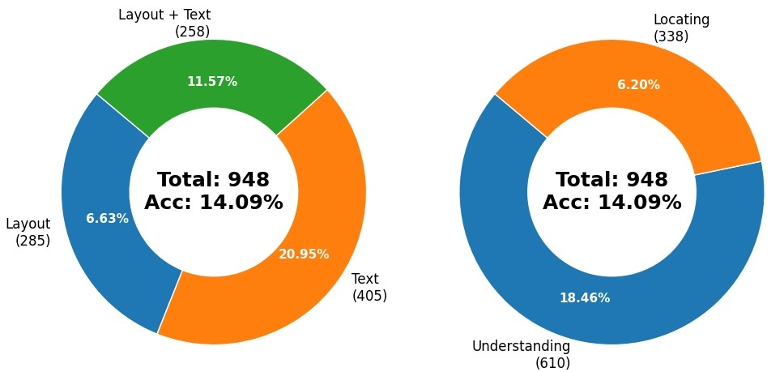
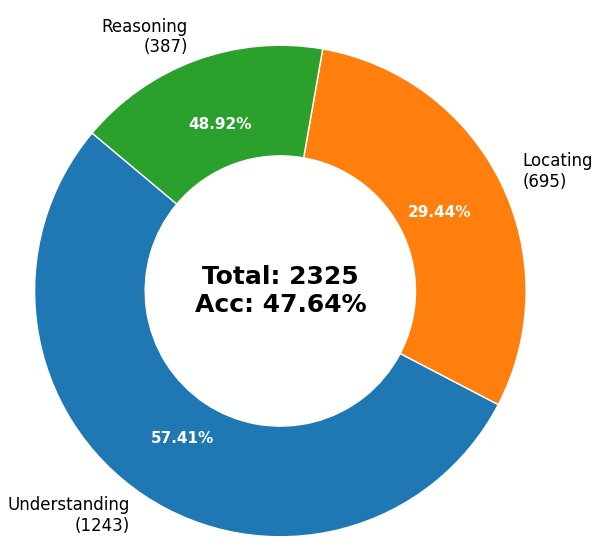
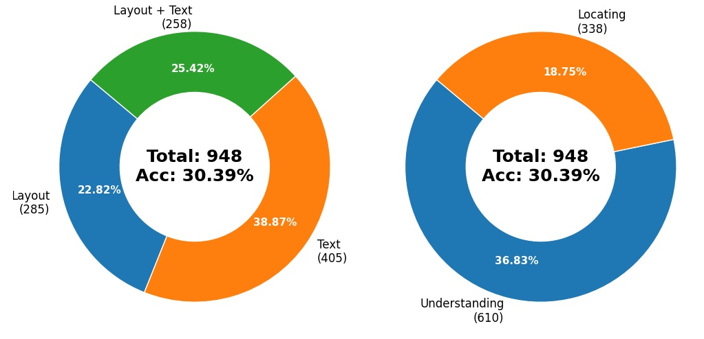
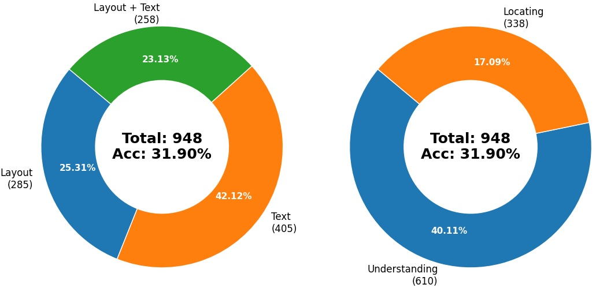

# RAG testing

This repository provides a framework for evaluating and comparing different retrieval strategies for RAG systems, using the [LongDocURL](https://github.com/dengc2023/LongDocURL) benchmark

The primary goal is to analyze how different document parsing and retrieval methods impact the quality of LLM responses on documents.

## Tested Dataset Overview

Dataset was created by selecting all Understanding and Locating questions with evidence elements being Text and Layout.

## Tested Strategies

- Questioning without any retrieved data.

- Questioning using cut-off paradigm from [LongDocURL](https://github.com/dengc2023/LongDocURL).

- Questioning using [PyMuPDF](https://pymupdf.readthedocs.io/en/latest/) based classic RAG algorithm with 500 chunk size and 100 overlap.

- Questioning using [MinerU](https://github.com/opendatalab/mineru) based RAG algorithm.

- Questioning using [PageR](Pager) based RAG algorithm.

## Dependencies & Versions

- MinerU: v3.0.4.
- Tesseract OCR: v5.5.0.20241111 (System dependency).
- Python: 3.13.7.
- Full Python dependency list can be found in requirements.txt.
- Embeddings Model: [distiluse-base-multilingual-cased-v1](https://huggingface.co/sentence-transformers/distiluse-base-multilingual-cased-v1).
- Model used for questioning is [Qwen2.5-VL-7B-Instruct-Q4_K_M.gguf](https://huggingface.co/lmstudio-community/Qwen2.5-VL-7B-Instruct-GGUF) hosted in LM Studio.
